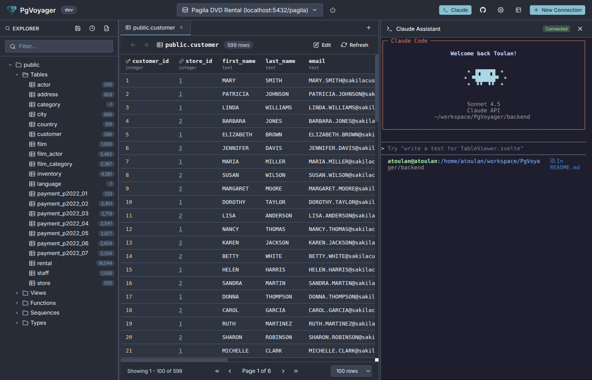
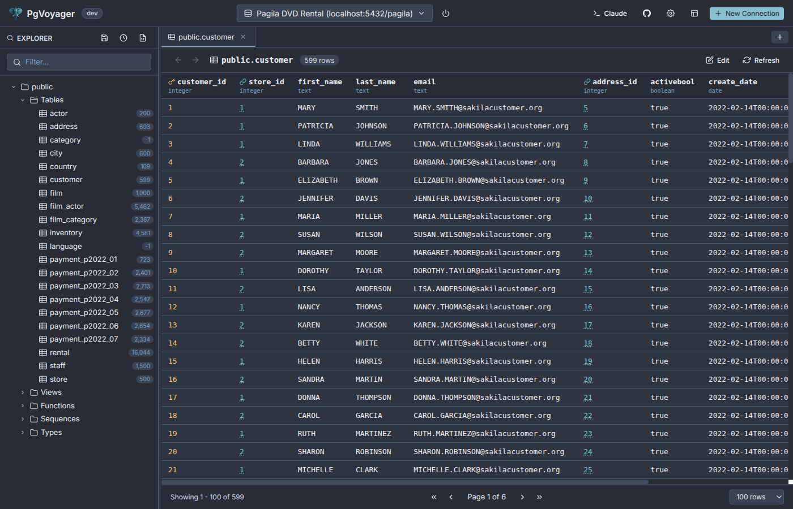
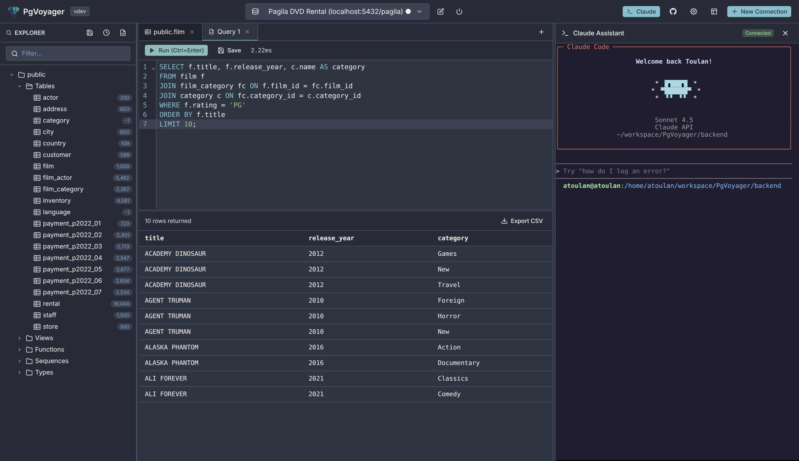
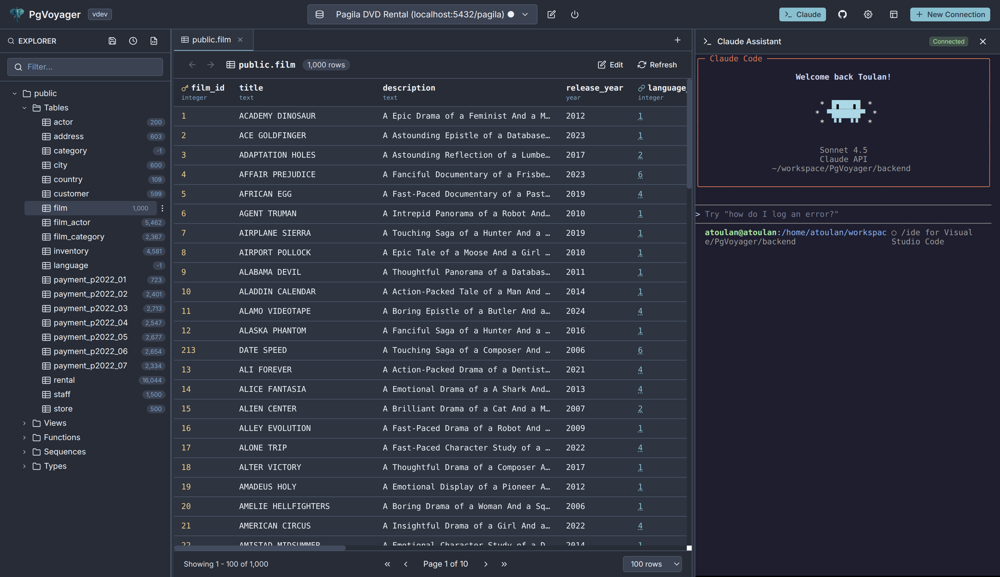

<p align="center">
  
</p>

<h1 align="center">PgVoyager</h1>

<p align="center">
  <strong>A PostgreSQL database explorer with an embedded Claude Code terminal</strong><br>
  Built entirely through vibe coding with Claude
</p>

<p align="center">
  <a href="#features">Features</a> •
  <a href="#installation">Installation</a> •
  <a href="#getting-started">Getting Started</a> •
  <a href="#development">Development</a> •
  <a href="https://github.com/thelinuxer/pgvoyager/releases">Releases</a>
</p>

---

<p align="center">
  
</p>

## Features

PgVoyager is a modern PostgreSQL client that combines schema exploration, SQL editing, and AI assistance in one sleek interface.

### Schema Browser

Browse your database structure with ease. Explore schemas, tables, views, functions, sequences, and custom types. See column details, constraints, indexes, and foreign key relationships at a glance.

<p align="center">
  
</p>

### SQL Query Editor

Write and execute SQL with a full-featured editor powered by CodeMirror. Features include syntax highlighting, autocomplete, error highlighting, and query history tracking.

<p align="center">
  
</p>

### Claude Code Terminal

The star of the show. An embedded Claude Code terminal with MCP integration that can explore your database schema, write SQL queries directly into the editor, execute queries and analyze results, and help you understand your data.

<p align="center">
  
</p>

## Installation

### Prerequisites

- **Claude Code CLI** - For the embedded AI assistant (`npm install -g @anthropic-ai/claude-code` or see [Claude Code docs](https://docs.anthropic.com/en/docs/claude-code))
- **PostgreSQL** - A database to connect to

### Download

Download the latest release for your platform from [GitHub Releases](https://github.com/thelinuxer/pgvoyager/releases).

#### Linux

```bash
curl -L https://github.com/thelinuxer/pgvoyager/releases/latest/download/pgvoyager-linux-amd64.tar.gz | tar xz
cd pgvoyager-linux-amd64
./install.sh
```

#### Windows

Download `pgvoyager-windows-amd64.zip`, extract, and run `install.ps1`.

#### macOS

```bash
curl -L https://github.com/thelinuxer/pgvoyager/releases/latest/download/pgvoyager-darwin-arm64 -o pgvoyager
chmod +x pgvoyager
PGVOYAGER_MODE=production ./pgvoyager
```

Then open `http://localhost:8081` in your browser.

## Getting Started

1. Launch PgVoyager and open `http://localhost:8081`
2. Click "New Connection" and enter your PostgreSQL credentials
3. Browse your schemas in the left sidebar
4. Open a query tab and write some SQL
5. Click the Claude icon to open the AI assistant

## Development

### Building from Source

**Prerequisites:** Go 1.24+, Node.js 20+

```bash
git clone https://github.com/thelinuxer/pgvoyager.git
cd pgvoyager
make install
make build-prod
PGVOYAGER_MODE=production ./bin/pgvoyager
```

### Development Mode

```bash
make dev
```

Starts backend on `http://localhost:8081` and frontend on `http://localhost:5173`.

## Architecture

```
Frontend (Svelte) <──WebSocket──> Backend (Go) ──PTY──> Claude Code CLI
                                       │                       │
                                       │                       │ MCP
                                       │                       ▼
                                       └────────────> PgVoyager MCP Server
```

- **Frontend**: SvelteKit 2 + Svelte 5, CodeMirror for SQL, xterm.js for terminal
- **Backend**: Go + Gin, manages database connections and Claude sessions
- **MCP Server**: Separate Go binary that gives Claude access to database tools

### MCP Tools

| Tool | Description |
|------|-------------|
| `get_connection_info` | Current database connection details |
| `list_schemas` | All schemas in the database |
| `list_tables` | Tables (optionally filtered by schema) |
| `get_columns` | Column details for a table |
| `get_table_info` | Table size, row count, etc. |
| `execute_query` | Run arbitrary SQL |
| `list_views` | Database views |
| `list_functions` | Database functions |
| `get_foreign_keys` | Foreign key relationships |
| `get_indexes` | Index information |
| `get_editor_content` | Read SQL from the query editor |
| `insert_to_editor` | Insert text into the editor |
| `replace_editor_content` | Replace editor content |

## Troubleshooting

### Claude terminal not working

Make sure Claude Code CLI is installed and in your PATH:
```bash
npm install -g @anthropic-ai/claude-code
claude --version
```

### Connection issues

Check that your PostgreSQL server is running and accessible. SSL is enabled by default; you can disable it in the connection settings.

## License

MIT
