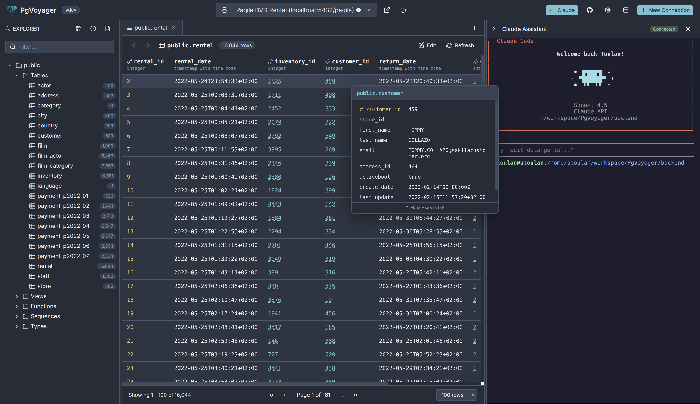
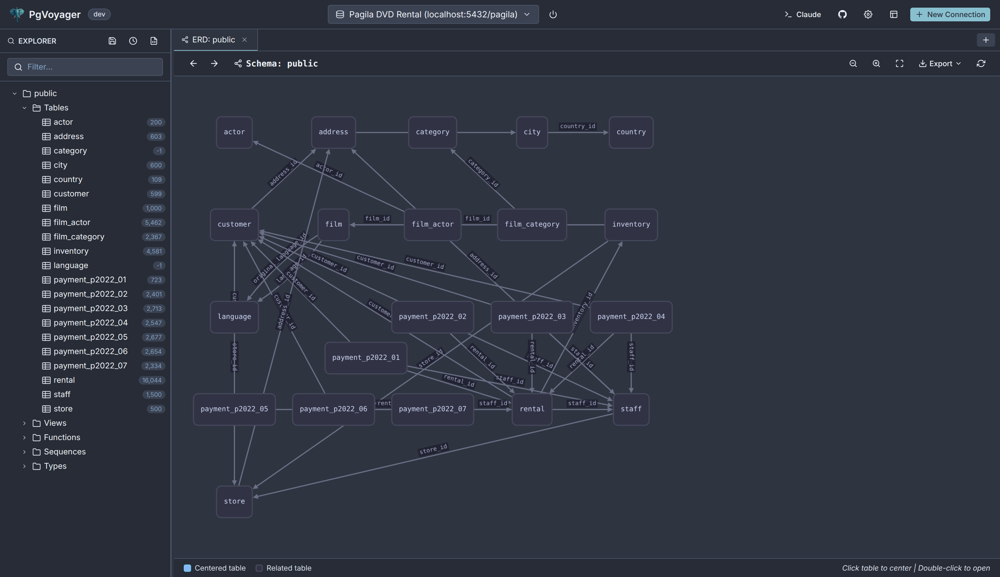
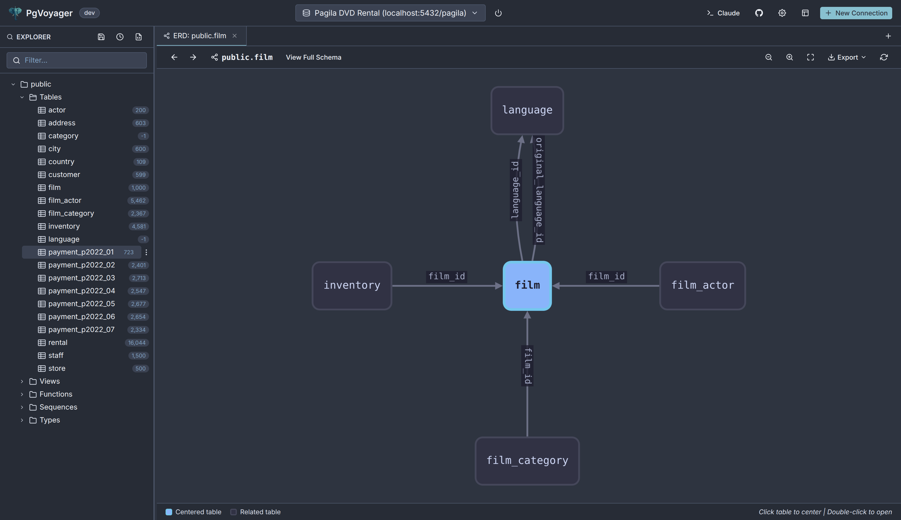
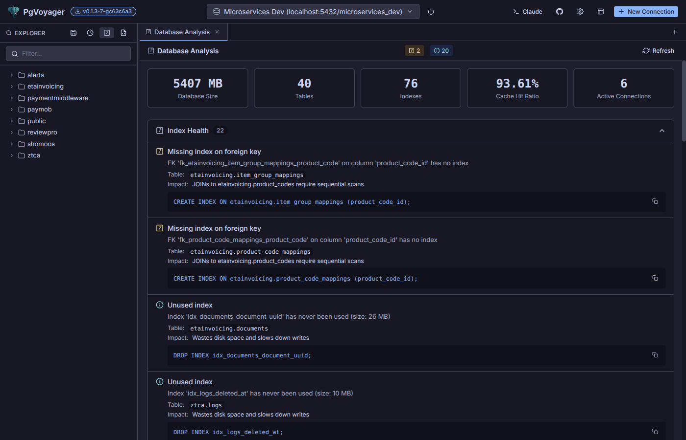
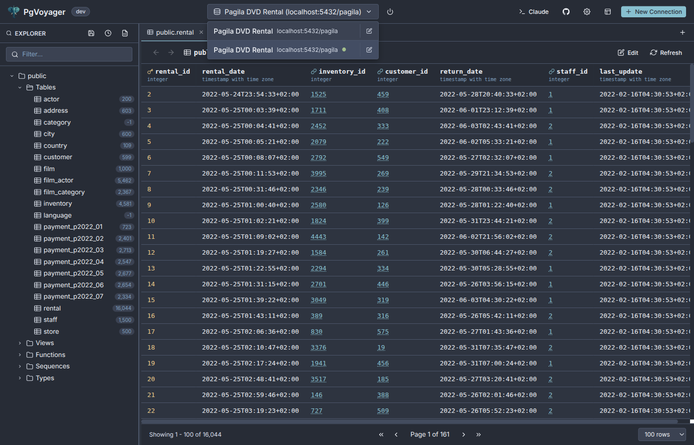
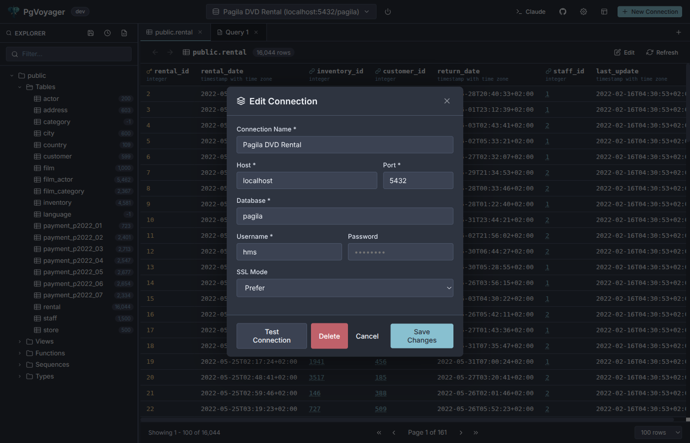

<p align="center">
  
</p>

<h1 align="center">PgVoyager</h1>

<p align="center">
  <strong>A modern PostgreSQL database explorer with schema browser, SQL editor, ERD visualization, and embedded Claude Code terminal</strong>
</p>

<p align="center">
  <a href="https://github.com/thelinuxer/pgvoyager/releases/latest"></a>
  <a href="https://github.com/thelinuxer/pgvoyager/blob/master/LICENSE"></a>
  <a href="https://github.com/thelinuxer/pgvoyager/actions"></a>
  
  
  
</p>

<p align="center">
  <a href="#features">Features</a> •
  <a href="#installation">Installation</a> •
  <a href="#getting-started">Getting Started</a> •
  <a href="#mcp-integration">MCP Integration</a> •
  <a href="#development">Development</a> •
  <a href="https://github.com/thelinuxer/pgvoyager/releases">Releases</a>
</p>

---

<p align="center">
  
</p>

## Features

PgVoyager is a modern PostgreSQL client that combines schema exploration, SQL editing, and AI assistance in one sleek interface.

### Schema Browser

Browse your database structure with ease. Explore schemas, tables, views, functions, sequences, and custom types. See column details, constraints, indexes, and foreign key relationships at a glance.

<p align="center">
  
</p>

### SQL Query Editor

Write and execute SQL with a full-featured editor powered by CodeMirror. Features include syntax highlighting, autocomplete, error highlighting, and query history tracking.

<p align="center">
  
</p>

### Foreign Key Preview

Hover over any foreign key value to instantly see the referenced record. No more jumping between tables to understand relationships.

<p align="center">
  
</p>

### ERD Visualization

Visualize your database relationships with interactive Entity Relationship Diagrams. Right-click any table to see its direct relationships in a centered view, or view the entire schema at once. Click nodes to navigate between tables, double-click to open them, and export diagrams as PNG, SVG, JSON, or SQL DDL.

<p align="center">
  
</p>

<p align="center">
  
</p>

### Database Analysis

Analyze your database health with a single click. PgVoyager identifies potential issues like missing indexes on foreign keys, unused indexes, table bloat, missing primary keys, and more. Each issue includes a severity level, description, and a suggested SQL fix you can copy with one click.

<p align="center">
  
</p>

### Claude Code Terminal

The star of the show. An embedded Claude Code terminal with MCP integration that can explore your database schema, write SQL queries directly into the editor, execute queries and analyze results, and help you understand your data.

<p align="center">
  
</p>

### Connection Management

Easily manage your database connections. Click the edit icon next to any connection to modify settings or delete connections you no longer need - even if they can't connect.

<p align="center">
  
  
</p>

## Installation

### Prerequisites

- **Claude Code CLI** - For the embedded AI assistant (`npm install -g @anthropic-ai/claude-code` or see [Claude Code docs](https://docs.anthropic.com/en/docs/claude-code))
- **PostgreSQL** - A database to connect to

### Download

Download the latest release for your platform from [GitHub Releases](https://github.com/thelinuxer/pgvoyager/releases).

#### Linux

```bash
curl -L https://github.com/thelinuxer/pgvoyager/releases/latest/download/pgvoyager-linux-amd64.tar.gz | tar xz
cd pgvoyager-linux-amd64
./install.sh
```

#### Windows

Download `pgvoyager-windows-amd64.zip`, extract, and run `install.ps1`.

#### macOS

```bash
curl -L https://github.com/thelinuxer/pgvoyager/releases/latest/download/pgvoyager-darwin-arm64 -o pgvoyager
chmod +x pgvoyager
PGVOYAGER_MODE=production ./pgvoyager
```

Then open `http://localhost:5137` in your browser.

## Getting Started

1. Launch PgVoyager and open `http://localhost:5137`
2. Click "New Connection" and enter your PostgreSQL credentials
3. Browse your schemas in the left sidebar
4. Open a query tab and write some SQL
5. Click the Claude icon to open the AI assistant

## Development

### Building from Source

**Prerequisites:** Go 1.24+, Node.js 20+

```bash
git clone https://github.com/thelinuxer/pgvoyager.git
cd pgvoyager
make install
make build-prod
PGVOYAGER_MODE=production ./bin/pgvoyager
```

### Development Mode

```bash
make dev
```

Starts backend on `http://localhost:5137` and frontend on `http://localhost:5173`.

## MCP Integration

PgVoyager includes a Model Context Protocol (MCP) server that enables Claude to interact directly with your database. The MCP server is automatically configured when you open the Claude terminal.

### Available Tools

Claude can use these tools to help you work with your database:

| Tool | Description |
|------|-------------|
| `get_connection_info` | Current database connection details |
| `list_schemas` | All schemas in the database |
| `list_tables` | Tables (optionally filtered by schema) |
| `get_columns` | Column details for a table |
| `get_table_info` | Table size, row count, etc. |
| `execute_query` | Run arbitrary SQL |
| `list_views` | Database views |
| `list_functions` | Database functions |
| `get_foreign_keys` | Foreign key relationships |
| `get_indexes` | Index information |
| `get_editor_content` | Read SQL from the query editor |
| `insert_to_editor` | Insert text into the editor |
| `replace_editor_content` | Replace editor content |

### Example Prompts

- "Show me all tables in the public schema"
- "Write a query to find users who haven't logged in for 30 days"
- "Analyze the orders table and suggest indexes"
- "Help me understand the relationship between users and orders"

## Architecture

PgVoyager is built with **Go** for the backend and **Svelte** for the frontend:

```
┌─────────────────────────────────────────────────────────────────────────┐
│                              Browser                                    │
│  ┌──────────────────────────────────────────────────────────────────┐   │
│  │                    Frontend (SvelteKit + Svelte 5)               │   │
│  │  • Schema Browser    • SQL Editor (CodeMirror)                   │   │
│  │  • ERD Viewer        • Terminal (xterm.js)                       │   │
│  └──────────────────────────────────────────────────────────────────┘   │
└─────────────────────────────────────────────────────────────────────────┘
                                    │
                          HTTP / WebSocket
                                    │
┌─────────────────────────────────────────────────────────────────────────┐
│                         Backend (Go + Gin)                              │
│  • Connection Management    • Query Execution                           │
│  • Schema Introspection     • Claude Session Manager (PTY)              │
│  • Query History            • Static File Server                        │
└─────────────────────────────────────────────────────────────────────────┘
                                    │
                          MCP Protocol
                                    │
┌─────────────────────────────────────────────────────────────────────────┐
│                      MCP Server (Go binary)                             │
│  • Database Tools           • Editor Integration                        │
│  • Schema Discovery         • Query Execution                           │
└─────────────────────────────────────────────────────────────────────────┘

```

### Tech Stack

| Component | Technology |
|-----------|------------|
| **Backend** | Go 1.24+, Gin web framework, lib/pq PostgreSQL driver |
| **Frontend** | SvelteKit 2, Svelte 5, TypeScript, CodeMirror 6, xterm.js |
| **Database** | PostgreSQL (any version), SQLite (for local storage) |
| **AI Integration** | Claude Code CLI, Model Context Protocol (MCP) |

## Troubleshooting

### Claude terminal not working

Make sure Claude Code CLI is installed and in your PATH:
```bash
npm install -g @anthropic-ai/claude-code
claude --version
```

### Connection issues

Check that your PostgreSQL server is running and accessible. SSL is enabled by default; you can disable it in the connection settings.

### Port already in use

PgVoyager runs on port 5137 by default. If it's in use, set the `PGVOYAGER_PORT` environment variable:

```bash
PGVOYAGER_PORT=5200 ./pgvoyager
```

## License

This project is licensed under the MIT License - see the [LICENSE](LICENSE) file for details.

## Acknowledgments

- Built with [Claude Code](https://claude.ai) - Anthropic's AI coding assistant
- [Gin](https://gin-gonic.com/) - Go web framework
- [SvelteKit](https://kit.svelte.dev/) - Web application framework
- [CodeMirror](https://codemirror.net/) - Code editor component
- [xterm.js](https://xtermjs.org/) - Terminal emulator
